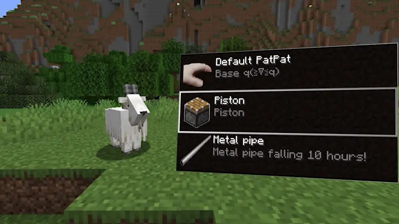
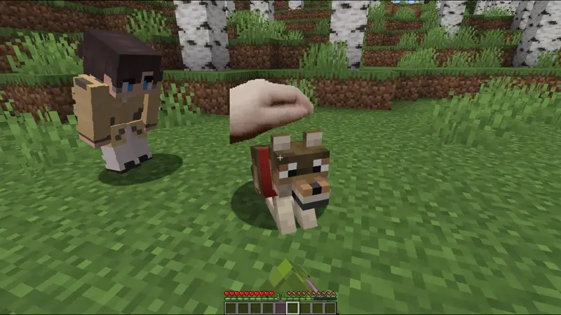
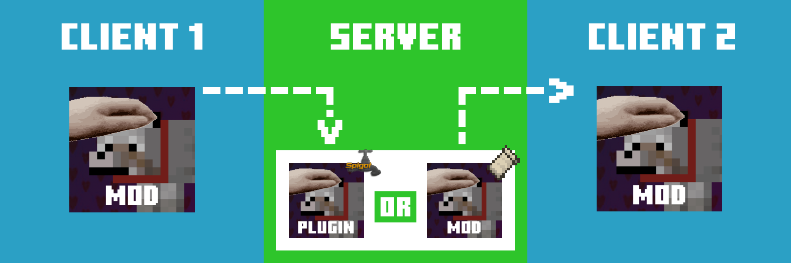

  [![Support Link-Banner [Boosty]](https://cdn.modrinth.com/data/cached_images/dce91fef079649dee277c52a998fc068e745e99e.png)](https://boosty.to/lopymine/donate)

 

# 💬 Description
Simple in-use client side Fabric mod for patting any (living) mobs! If you have ever wanted to pet your pet, this mod is for you!

# 🔥 Custom Animations
You can create your OWN animations, and then upload them to Modrinth or CurseForge, because they can be created by using resource packs! Read [**Wiki**](https://github.com/LopyMine/PatPat/wiki/) for more information.

Below you can see some of the custom animations that were made during the DEV period :D

# 🎮 Multiplayer Support
Also this mod supports multiplayer, just by adding this mod at the server you can patting together with friends!

# ⚡ PatPat Plugin

If you have non-Fabric server, you can install PatPat Plugin on your Bukkit/Spigot/Paper server! This Plugin just provides the server-side functionality of the PatPat for non-Fabric Servers.

For now, the PatPat Plugin should support most of the currently available server cores, such as Bukkit, Spigot, Paper and on other their forks. I recommend just to test it on your server.

**If you see that this plugin doesn't work at your server, please open issue about it at [**Github Issues**](https://github.com/LopyMine/PatPat-Plugin/issues) page.** Currently, in plans to add support for Velocity servers.

# 📔 Open Source

All code of PatPat Mod and Plugin is open source. Anyone can read and verify it!

| PatPat | Link |
| ------- | ------- |
| Mod | [**Github**](https://github.com/LopyMine/PatPat) |
| Plugin | [**Github**](https://github.com/LopyMine/PatPat-Plugin) |
