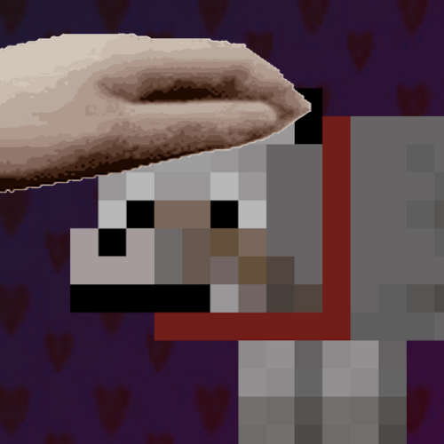

README IS WIP

  [![Support Link-Banner [Boosty]](https://cdn.modrinth.com/data/cached_images/dce91fef079649dee277c52a998fc068e745e99e.png)](https://boosty.to/lopymine/donate)

 

# Description
Simple mod for patting any (living) mobs! If you have ever wanted to pet your pet, this mod is for you!

# Custom Animations
You can create your OWN animations, and then upload them to Modrinth or CurseForge,
because they can be created by using resource packs!
Read this [Wiki](https://github.com/nikita51bot/nikita51bot/wiki/%D0%9A%D0%B0%D1%81%D1%82%D0%BE%D0%BC%D0%BD%D1%8B%D0%B5-%D0%90%D0%BD%D0%B8%D0%BC%D0%B0%D1%86%D0%B8%D0%B8) for more information.

Below you can see some of the custom animations that were made during the DEV period :D

# Multiplayer Support
Also, this mod supports multiplayer!
Just by adding this mod to the server, you can pat together with friends!
If you have a non-Fabric server,
you can install [PatPat Plugin](https://modrinth.com/project/patpat-plugin) on your Bukkit/Spigot/Paper server!

(Гифка, где два игрока по очереди патают одного моба и снизу этой гифки иконки Bukkit/Spigot/Paper, также добавить сюда ссылку на Spigot плагин)